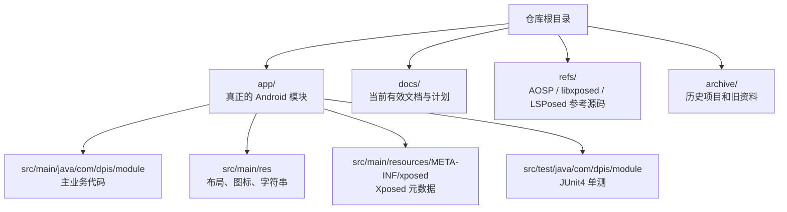
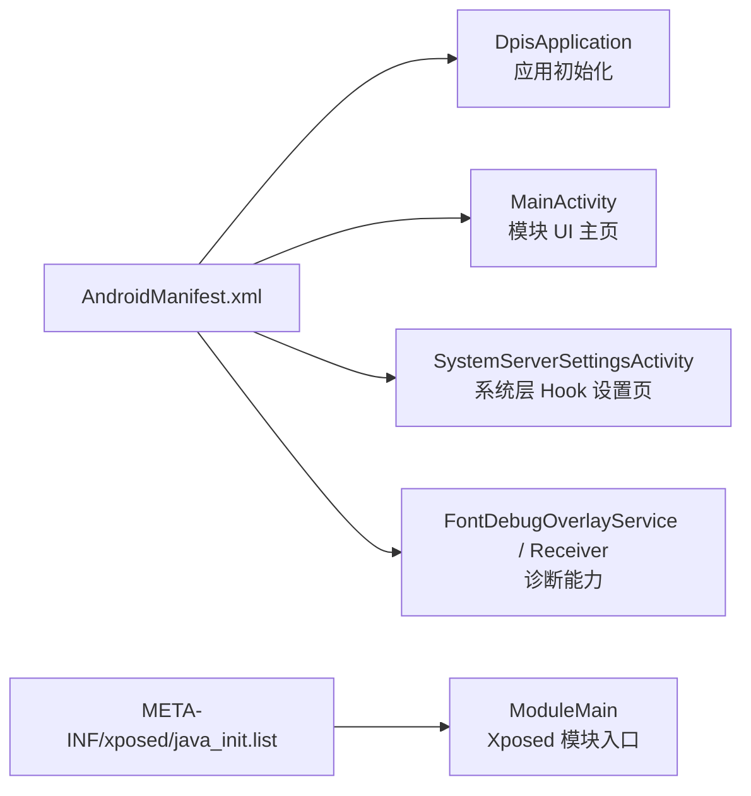
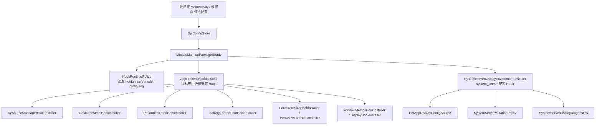
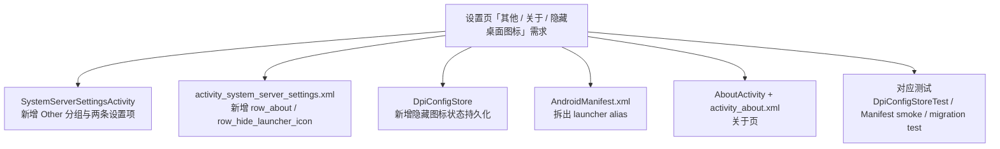

# DPIS 项目可视化展开图（2026-04-19）

这份文档用于把 DPIS 从“目录集合”展开成“入口、职责、链路、修改落点”的项目地图。

目标读者默认按当前仓库协作者处理，重点帮助你快速回答这几类问题：

- 这个项目的主入口在哪里
- UI 设置改动应该从哪几层下手
- 每应用 DPI / 字体配置是怎么流到 Hook 链路里的
- `system_server` 和普通目标应用进程分别走哪条路径
- `docs/superpowers/plans/2026-04-19-settings-other-about-hide-icon.md` 这类需求应该挂到哪里

## 1. 一眼看全局



## 2. 目录展开

```text
DPIS/
├── app/
│   ├── src/main/java/com/dpis/module/      # 主代码
│   ├── src/main/res/                       # XML 布局、drawable、strings
│   ├── src/main/resources/META-INF/xposed/ # 模块入口声明
│   └── src/test/java/com/dpis/module/      # 单元测试
├── docs/                                   # 当前有效文档、设计、计划
├── refs/                                   # 对照参考，不参与主构建
├── archive/                                # 历史项目/实验资料
├── build.gradle.kts                        # 根构建配置
├── settings.gradle.kts                     # 单模块项目设置
└── README.md                               # 当前项目说明
```

## 3. 运行视角

### 3.1 App 侧与模块侧双入口



### 3.2 配置到生效的主链路



## 4. 核心模块分层

### 4.1 UI 层

- `MainActivity`
  - 模块主界面。
  - 管应用列表、搜索、分页、筛选、编辑弹窗、启停目标进程。
- `SystemServerSettingsActivity`
  - 系统层 Hook 开关、安全模式、全局日志、字体调试面板。
- `AppListPagerAdapter` / `AppListPage` / `AppListFilter*`
  - 负责把“全部应用 / 已配置应用”组织成 UI 页面。
- `AppStatusFormatter`
  - 把一个应用的当前配置状态拼成用户可见的状态文本。

### 4.2 配置层

- `DpiConfigStore`
  - 整个项目最关键的状态存储中心。
  - 存包名集合、viewport 宽度、字体百分比、字体模式、system_server 开关、日志开关、调试状态。
- `ConfigStoreFactory`
  - 决定在 UI 或 Xposed 宿主里怎么拿到配置源。
- `DpisApplication`
  - 应用初始化、服务状态广播、配置迁移入口。

### 4.3 应用进程 Hook 层

- `ModuleMain`
  - Xposed 入口总编排。
  - 判断当前包是否命中配置，然后委托安装具体 Hook。
- `AppProcessHookInstaller`
  - 统一决定当前包需要装哪些 Hook。
- `DisplayHookInstaller` / `WindowMetricsHookInstaller`
  - 负责 viewport / display 相关覆写。
- `ActivityThreadFontHookInstaller`
  - 字体系统伪装路径。
- `ForceTextSizeHookInstaller` / `PaintTextSizeFallbackHookInstaller` / `WebViewFontHookInstaller`
  - 字体字段替换和兜底路径。

### 4.4 system_server Hook 层

- `SystemServerDisplayEnvironmentInstaller`
  - `system_server` 链路核心入口。
  - 对目标入口安装 Hook，并把 per-app 环境覆写到系统分发路径里。
- `PerAppDisplayConfigSource`
  - 从 `DpiConfigStore` 抽取“某个包的有效显示配置”。
- `SystemServerMutationPolicy`
  - 决定哪些 system_server 入口可安装、是否属于安全模式。
- `SystemServerDisplayDiagnostics` / `SystemServerHookLogGate` / `SystemServerHotPathInspector`
  - 诊断、降噪、热路径控制。

## 5. 功能到代码的映射

| 你想改的东西 | 先看哪里 | 典型联动文件 |
|---|---|---|
| 应用列表展示、搜索、分页 | `MainActivity` | `AppListPagerAdapter`、`AppListPage`、`item_app_list_page.xml` |
| 单个应用的配置弹窗 | `MainActivity` | `dialog_app_config.xml`、`AppStatusFormatter`、`DpiConfigStore` |
| 系统层 Hook 开关 | `SystemServerSettingsActivity` | `DpiConfigStore`、`HookRuntimePolicy`、`SystemServerDisplayEnvironmentInstaller` |
| viewport 覆写逻辑 | `DisplayHookInstaller` | `WindowMetricsHookInstaller`、`ViewportOverride`、`PerAppDisplayConfigSource` |
| 字体缩放 / 字体模式 | `ActivityThreadFontHookInstaller` | `ForceTextSizeHookInstaller`、`FontScaleOverride`、`FontApplyMode` |
| 配置项如何持久化 | `DpiConfigStore` | `DpisApplication`、`ConfigStoreFactory` |
| Xposed 生命周期入口 | `ModuleMain` | `AppProcessHookInstaller`、`SystemServerDisplayEnvironmentInstaller` |
| 文案、标题、按钮文本 | `res/values/strings.xml` | 对应 Activity / layout XML |
| 设置页新增一行 | `activity_system_server_settings.xml` | `SystemServerSettingsActivity`、`item_settings_entry.xml`、`item_settings_switch.xml` |

## 6. 你当前提到的计划文档，应该挂在哪

你提到的计划文件：

- [2026-04-19-settings-other-about-hide-icon.md](E:\System\Documents\GitHub\DPIS\docs\superpowers\plans\2026-04-19-settings-other-about-hide-icon.md)

它在当前架构中的落点可以直接画成这张图：



也就是说，这个需求不是孤立页面改动，而是横跨四层：

1. `res/layout` 和 `strings.xml`
2. `SystemServerSettingsActivity`
3. `DpiConfigStore` / `DpisApplication`
4. `AndroidManifest.xml`

## 7. 推荐的阅读顺序

如果你是想“把项目真正读懂”，建议按这条线走：

1. [README.md](E:\System\Documents\GitHub\DPIS\README.md)
2. [AndroidManifest.xml](E:\System\Documents\GitHub\DPIS\app\src\main\AndroidManifest.xml)
3. [MainActivity.java](E:\System\Documents\GitHub\DPIS\app\src\main\java\com\dpis\module\MainActivity.java)
4. [SystemServerSettingsActivity.java](E:\System\Documents\GitHub\DPIS\app\src\main\java\com\dpis\module\SystemServerSettingsActivity.java)
5. [DpiConfigStore.java](E:\System\Documents\GitHub\DPIS\app\src\main\java\com\dpis\module\DpiConfigStore.java)
6. [ModuleMain.java](E:\System\Documents\GitHub\DPIS\app\src\main\java\com\dpis\module\ModuleMain.java)
7. [AppProcessHookInstaller.java](E:\System\Documents\GitHub\DPIS\app\src\main\java\com\dpis\module\AppProcessHookInstaller.java)
8. [SystemServerDisplayEnvironmentInstaller.java](E:\System\Documents\GitHub\DPIS\app\src\main\java\com\dpis\module\SystemServerDisplayEnvironmentInstaller.java)

这条顺序对应的是：

`用户能看到什么` -> `配置怎么存` -> `Xposed 什么时候读配置` -> `Hook 最终怎么装进去`

## 8. 当前仓库的阅读边界

为了避免读偏，可以先把仓库分成三类：

- 主线开发区
  - `app/`
  - `docs/`
- 参考资料区
  - `refs/`
- 历史/实验区
  - `archive/`
  - `docs/archive/`

如果你的目标是继续开发 DPIS，本轮优先盯 `app/` 和 `docs/superpowers/` 就够了，不需要一开始就陷进 `refs/` 或 `archive/`。

## 9. 下一步可选展开方式

如果你愿意，我可以继续把这个“图形化展开”再往下做成下面任一版本：

- UI 视角版
  - 专门画出每个页面、弹窗、按钮分别落在哪些 XML 和 Java 方法里。
- Hook 链路版
  - 专门画出 `viewport`、`font`、`system_server` 三条生效路径。
- 修改导航版
  - 你只要说“我想改某个功能”，我直接给你对应文件和修改入口。
